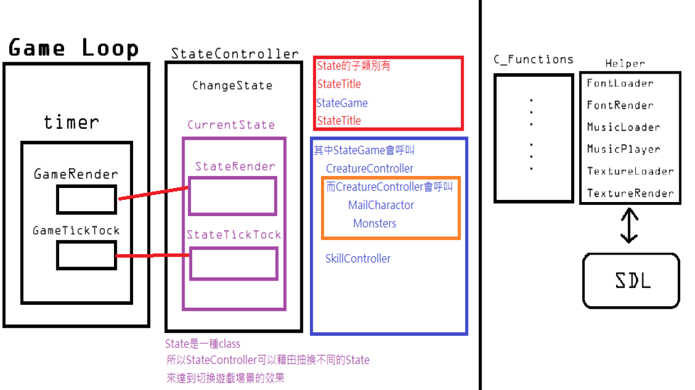

# Assembly-Language-Beast
This is my final project of assembly languages course,and it's a RPG. 
It's is very  similar to my java final project, but I improved the maze generation algorithm, and removed the minimap 
I tried to link .obj files generated by C/C++ and masm 
Using gcc, masm, makefile, SDL to create this game

## Play
You can download from here:
https://github.com/terrynini/Assembly-Language-Beast/releases

Space: attack, enter the game 
B:     backpack, but nothing there 

* The number on the upper right corner of window means the number of monster remaining
* Kill a monster would heal your charactor
* Map will be randomly generated every time
* HP of monster will be randomly generated, too

## Architecture

# Call C function in Assembly

## generate a *.o file
> $gcc -c test.c -o test.o

or add pragma to tell IDE not to link
>  #pragma src  

## generate a *.a file

>ar rcs libtst.a test.o

## Gcc tips
add this directive to notify gas using Intel syntax
>.intel_syntax noprefix

